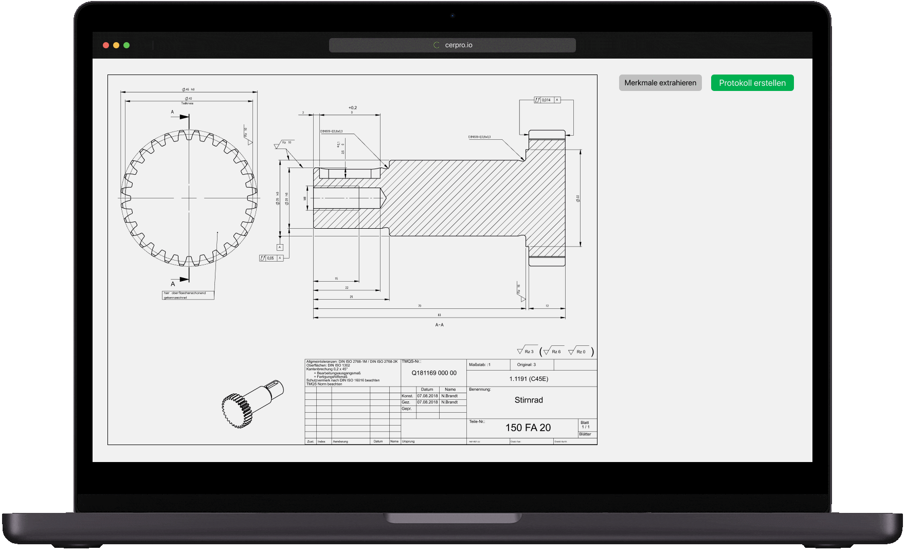

# AI-Powered CAD Drawing Automation System

## Overview

This project streamlines the manufacturing design process by combining AI and CAD tools to automatically process, analyze, and generate engineering drawings from PDF and image inputs. It leverages advanced computer vision and large language models (LLMs) to detect and classify mechanical parts, extract key dimensional data, and generate editable CAD files using AutoCAD and SolidWorks via VBA Macros.

## Features

- 📄 **File Import:** Supports importing of manufacturing design files in PDF and common image formats (JPG, PNG, etc.)
- 🧠 **AI Part Detection & Classification:** Automatically identifies and classifies parts in the drawings using AI and computer vision models.
- ✍️ **Manual Editing Interface:** Users can manually refine or correct the classified parts via an intuitive interface.
- 🔍 **Key Value Extraction:** Extracts critical dimensions, tolerances, and annotations from engineering drawings using OCR and LLMs.
- 🏗️ **CAD File Generation:** Converts the processed and extracted data into real, editable drawings using:
  - **AutoCAD VBA Macros**
  - **SolidWorks Macros / API**
- 🧩 **LLM Integration:** Uses large language models to enhance context-aware extraction, interpretation of design intent, and annotation clarification.

## Architecture

```plaintext
PDF/Image Input
     |
     v
[ Preprocessing ]  --> Clean up, scale normalization
     |
     v
[ AI Engine ]
  - Object Detection
  - Part Classification
  - Text Extraction (OCR)
     |
     v
[ Key Value Parser ]
  - Dimension Parsing
  - Feature Recognition
  - BOM Extraction (if applicable)
     |
     v
[ Drawing Generator ]
  - AutoCAD VBA Generator
  - SolidWorks Macro Creator
     |
     v
[ Output ]
  - Editable DWG/SOLIDWORKS files
```



## 🧰 Tech Stack

### 🔤 Languages
- Python
- VBA
- C#
- JavaScript (for optional UI)

### 🧠 AI Libraries
- OpenCV
- YOLO / Detectron2
- Tesseract OCR
- Hugging Face Transformers

### 🏗️ CAD Tools
- AutoCAD (via VBA)
- SolidWorks (via VBA / API)

### 🔍 LLMs
- OpenAI GPT-4
- Custom fine-tuned models

### 🧪 Other Tools
- PDFPlumber
- Pillow
- PyMuPDF
- CADLib

---

## ⚙️ Setup Instructions

### ✅ Prerequisites

- Python 3.8+
- AutoCAD (with VBA enabled)
- SolidWorks (with macro support)
- Tesseract OCR
- Node.js (optional UI)
- OpenAI API Key (or your own LLM endpoint)

### 🔧 Installation

1. **Clone the repository**

   ```bash
   git clone https://github.com/allpyjs/Estima-Manufacturing-Assist-Platform-Frontend
   cd estima-manufacturing-assist-platform-frontend
   ```


### 🧪 Usage
1. Start the Application
bash
Copy
Edit
python main.py
2. Upload a Drawing
Use the UI or CLI to upload a PDF or image file.

3. Automatic Detection
The system will process the drawing and identify parts and annotations.

4. Manual Edits (Optional)
Review detected parts and correct any misclassifications.

5. Generate CAD Output
Choose between AutoCAD or SolidWorks formats.

Macros will auto-generate editable files.


